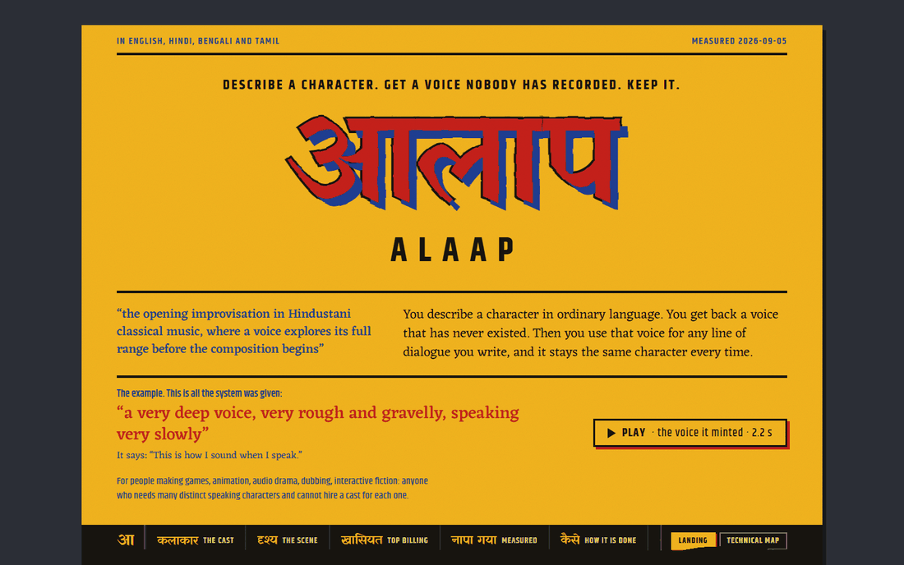
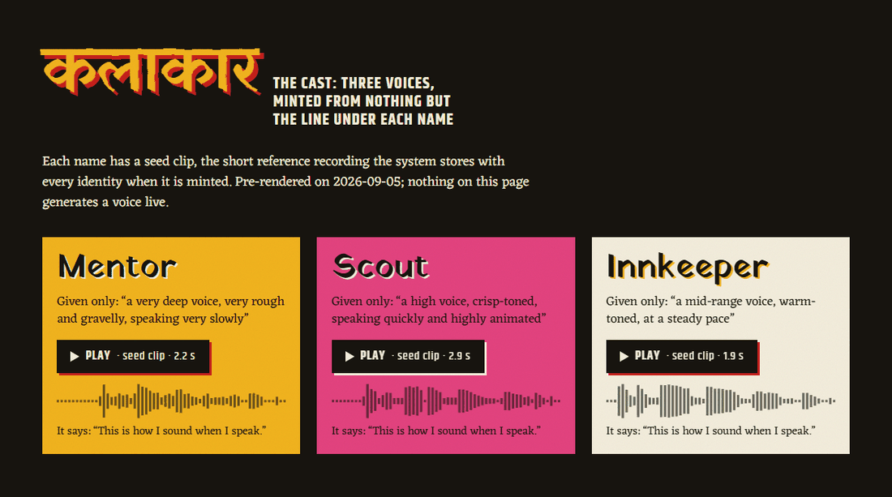
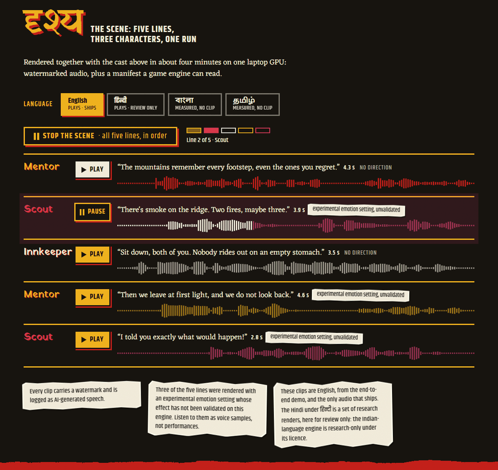
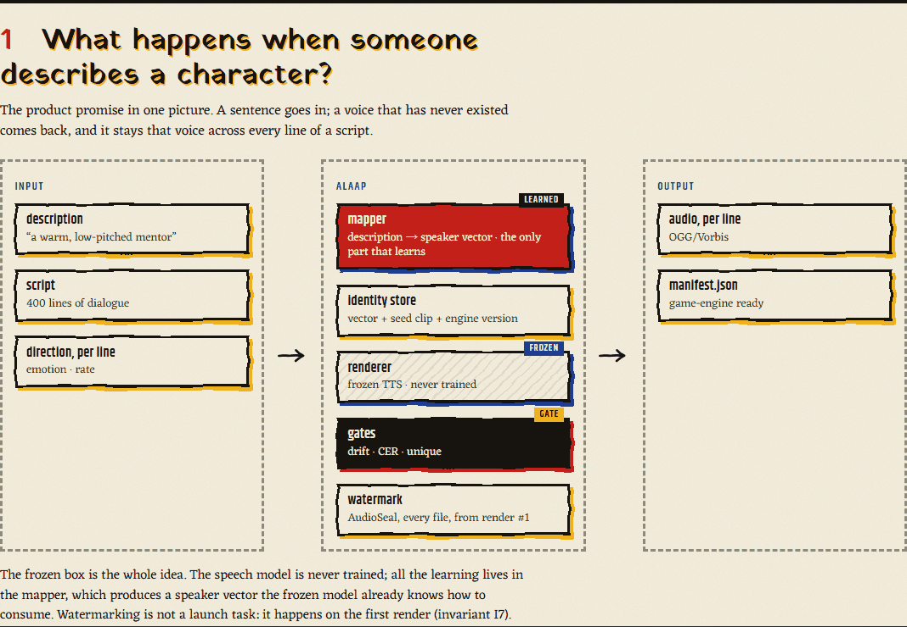
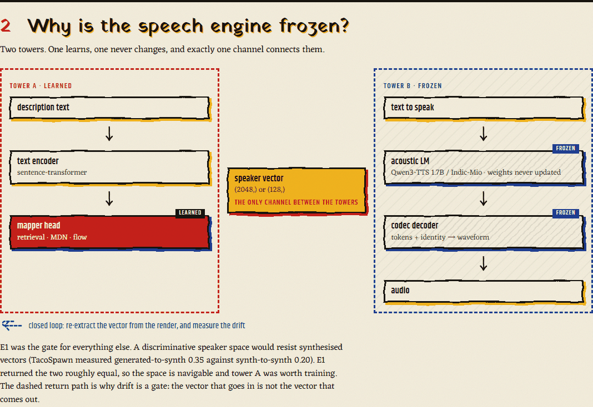
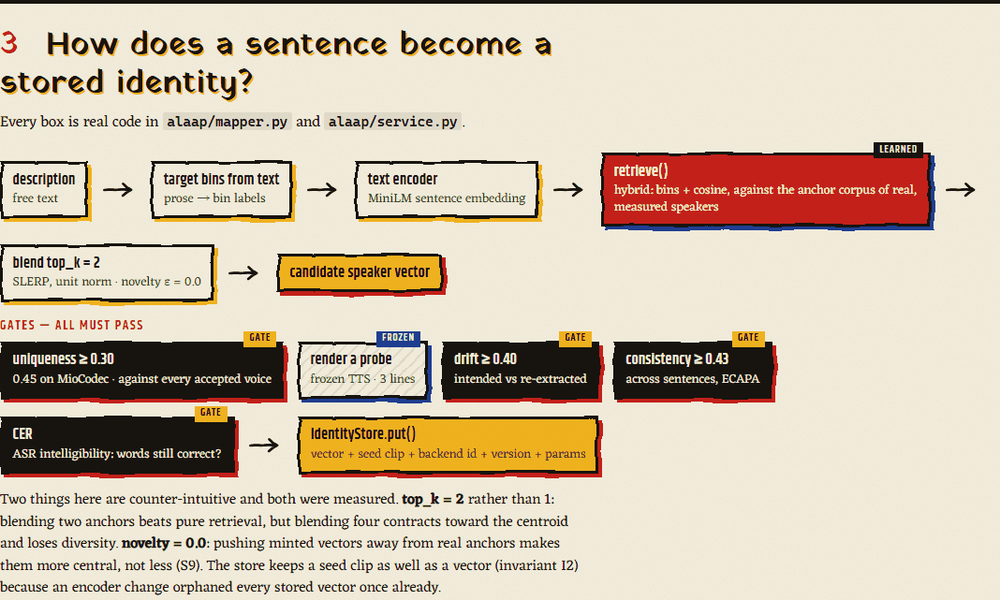
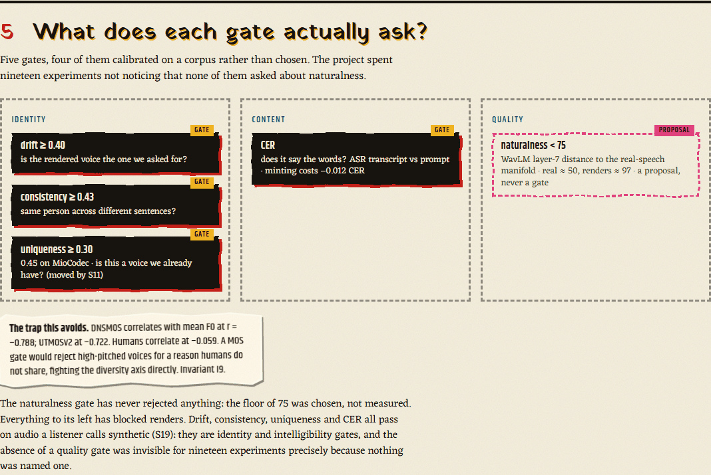
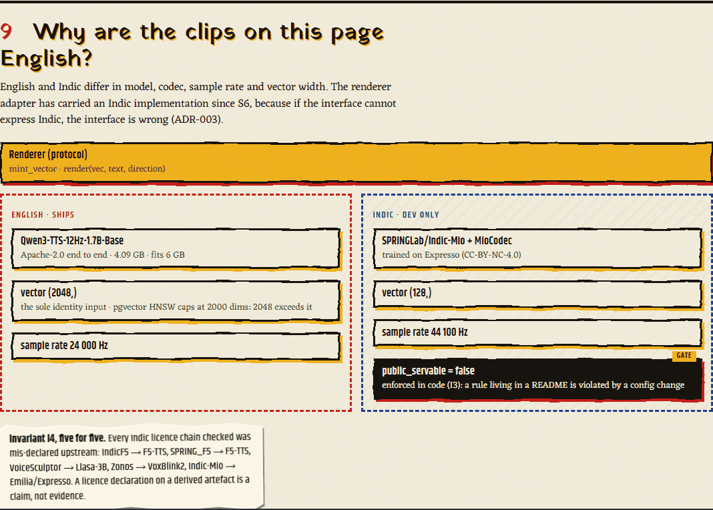
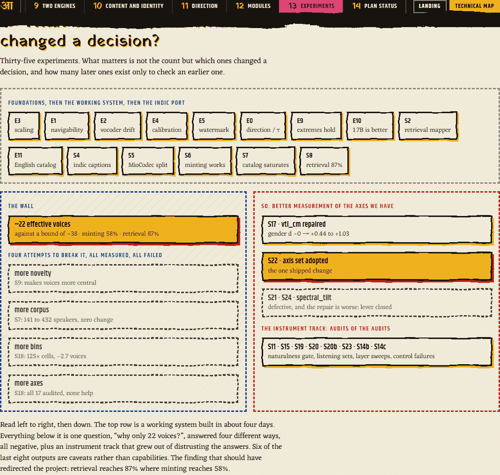

# Alaap · आलाप

**Natural-language character description → a persistent, reusable voice identity → arbitrary dialogue rendered in that voice.** English and Indian languages, at quality usable in games and dramatic content.

> *Alaap* — the opening improvisation in Hindustani classical music, where a voice explores its full range before the composition begins.

---

## Status: it works, end to end, in English and Hindi

**Built and measured.** Every number below is from a run in this repo, on one 6 GB laptop GPU.

| | |
|---|---|
| **Working system** | description → voice identity → arbitrary dialogue, watermarked, with a game-engine manifest |
| **Languages proven** | English (Qwen3-TTS) and **Hindi / Bengali / Tamil** (Indic-Mio + MioCodec) |
| **Experiments** | E0–E5, E9–E15 and S2, S4–S12 — each with a `RESULTS.md` stating what was *not* established |
| **Tests** | 114 invariant tests |
| **Licence posture** | research-only (`ADR-009`) — the Indic chain includes NC data, so no weights ship |

```bash
envs/qwen3/Scripts/python.exe scripts/demo_script_render.py   # ~4 min, end to end
```

Mints three characters from text descriptions, renders a five-line scene with per-line
emotion, watermarks everything, writes a manifest.

## The site

**[pranavmishra17.github.io/alaap](https://pranavmishra17.github.io/alaap/)** — the landing page: what it is, the three
minted voices and the five-line scene as real, watermarked clips, the four differences, what was measured with every
caveat pasted on, and what is honestly not there yet. Every claim on it is sourced in [`site/CONTENT.md`](site/CONTENT.md).

**[pranavmishra17.github.io/alaap/lab](https://pranavmishra17.github.io/alaap/lab/)** — the design lab: all twenty-eight
landing-page variants that were tried before this one, live, with each designer's notes. Source on the
[`design-lab`](https://github.com/PranavMishra17/alaap/tree/design-lab) branch.

[](https://pranavmishra17.github.io/alaap/)

The cast and the scene, with each character in its own enamel. The bars are drawn in the browser from the actual clips;
a line lights as it plays, and the language switch is honest about what ships (English) and what is measured but cannot
(Hindi, Bengali, Tamil — the Indian-language engine is research-only).






### The technical map

The page has a second view, **Landing · Technical map**, for engineers: the fourteen sections of
[`learning/architecture.html`](learning/architecture.html) as painted flow diagrams — what is learned, what is frozen,
where the checks sit, and what was tried that did not work. Red boxes learn; outlined boxes are never modified; black
boxes ask a question and can say no.













The site is Astro, plain HTML/CSS/JS, no framework; it builds from [`site/`](site/) and deploys with
[`.github/workflows/pages.yml`](.github/workflows/pages.yml), which publishes `main` to `/alaap/` and `design-lab` to
`/alaap/lab/` in one go.

---

### What was measured

**The two-tower split is real in Indic.** The same content tokens carried through two
speaker vectors give two different people saying identical words — ECAPA-TDNN, which has
never seen MioCodec, puts the render 61.5% of the way from "different person" to "same
person" against its donor and *negative* against the other (`S5`). CER spread between
identities is **0.000** on every line: who speaks has no effect on what is said (`S5b`).

**Minting a voice from a description costs no intelligibility.** CER 0.069 for minted
vectors against 0.081 for real donor vectors through identical content tokens — a
difference of **−0.012**, where two *real* speakers differ by 0.077 on a single line
(`S6b`).

**Retrieval beats minting, and both were mis-tuned.** Answering a description by
retrieving the nearest voice in a library reaches **87%** of the diversity a corpus
actually holds; minting reached **37%** (`S9`). The cause was two parameters — blending
`top_k` anchors in a `pca_dims`-truncated basis — and fixing them moved Indic from 14 to
**22 effective voices** and English from 23 to **41 (+81%)**, with drift and consistency
both *improving* (`S9b`, `S10`).

**Catalog search scales better than synthesis.** The same retrieval method scores 65.6%
exact adherence over 141 Indic voices and **88.5% over 2500 English voices** — no code
change, just a bigger library (`S8`, `S10`).

**Identity is provably robust to the text channel — and the documented emotion tags do
nothing.** Appending a tag costs 0.02 of ECAPA similarity against a 0.90 self-similarity
ceiling and moves `f0_mean` by ≤0.21 noise-floor units, so whatever you write in the text
cannot change who is speaking. But a fluent listener heard no emotion in any of
`<happy>`, `<sad>`, `<angry>`, `<surprise>`, and the reason is mechanical: **none of the
nine documented tags is a token** in Indic-Mio or its base model, and none is in the
added vocabulary. `<whisper>` does not whisper. **Word-level emphasis (`*word*`) fails too** — `*` *is* a
real token, yet emphasising an early versus a late word moves energy the same direction by
under one noise unit. The text channel carries no direction at all on this backend. Filed
upstream (`S13`, `S13b`).

**So direction is driven in the signal instead, and it works.** A phase vocoder moves
speaking rate over a 3.3× range while shifting pitch by at most 2.3 Hz; identity holds
at ECAPA 0.80–0.88 and English CER stays 0.000. Naive resampling — the negative control,
which moves pitch too — collapses identity to 0.10, so the check is sensitive. Measured
operating range: **0.67× to 1.43× normal speaking rate** (`S14`), now wired to
`Direction.rate` with the bound published and clamped. A listener qualified it at the
slow extreme — *"60% slowed down, 40% slow speech effect"* — so the bound is where
identity and words survive, not where the output stops sounding processed. One real
delivery axis with a measured bound; emotion still has no lever here.

**Description and direction use disjoint acoustic axes.** `speaking_rate` is nearly
worthless for identity (weight 0.10–0.31, measured on three corpora and two languages)
and is a **top delivery axis** (ratio 2.01 across emotions within a speaker). The axes
identity discards are the ones delivery uses — so a direction channel need not disturb
who is speaking. The exception is `f0_mean`, which is contested at 1.04 and must be
explicitly protected (`S12`).

**And the output is audibly synthetic — measured, not guessed.** A native listener told
real recordings from synthesis 7 times out of 7 decisive judgements, while calling two real
recordings equally real both times. Splitting it: the codec costs something on its own and
the model costs something on top, in roughly equal measure, so **there is no single
component to swap**. Most striking, the codec's contribution is invisible to every axis
this project measures — 0.0 dB of SNR and 0.18 dB of HNR between clips a listener
distinguished (`S19`).

### What is not established

- ~~There is no naturalness gate anywhere in the pipeline.~~ **`S20` built one**, and it
  separates cleanly — real speech scores 50, this project's renders score 98. Crucially it
  is *not* a MOS predictor: published MOS models correlate with pitch at r ≈ −0.79 where
  humans sit at −0.06, which would reject high-pitched voices for a reason people do not
  share. This one measures −0.021. It also detects the **codec's** own contribution,
  which took three attempts to establish — a first claim that it was blind rested on three
  clips, a second that it worked rested on an untested effect size, and only at 150 clips
  per side does it hold (`t = 2.59`). The sweep that found it also rejected a layer that
  separated the codec *by tracking pitch* at r = −0.578, which is exactly the failure the
  design was built to avoid (`S20b`).
- **Very little has been listened to.** The metrics are geometry and ASR. `S11` is a
  blind listening pilot — 8 pairs, controls 4/4 — and it immediately found the
  `uniqueness` floor was too low: voices 0.323 apart were heard as the same person half
  the time. Raising it to 0.45 removed 10 duplicate voices from 50 at a cost of 3% of
  effective diversity. **A borrowed threshold survived nine experiments before a person
  listened to it.**
- That pilot is n=8 with 2 pairs at the floor and one listener. It detects a problem; it
  does not locate the right threshold, and the English floor remains unvalidated.
- Catalog sizes are small (40–55 voices), single-seed, and Vendi-based.
- No commercial TTS has been measured; `S8`'s library is corpus speakers standing in for
  a studio voice library.

### A methodological note

Roughly twenty findings in this repo were **wrong on the first run and caught by a
control**, including one where an entire experiment decoded through the wrong codec and
produced fluent Hindi saying different words, with nothing raising. Each `RESULTS.md`
records the failure alongside the result. The recurring rule:

> **A suspiciously good or suspiciously bad number is a bug report about your setup.**
> Where a measurement has a property you can state in advance, assert it before reading
> the result.

---

## Read it in this order

| | |
|---|---|
| 1 | **[`RESEARCH/00-EXECUTIVE-VERDICT.md`](RESEARCH/00-EXECUTIVE-VERDICT.md)** — the verdict and the full corrections table |
| 2 | [`RESEARCH/GRAND-PLAN.md`](RESEARCH/GRAND-PLAN.md) — the route and the ten invariants |
| 3 | [`RESEARCH/phases/`](RESEARCH/phases/) — eleven per-stage specs with measured exit criteria |
| 4 | [`RESEARCH/`](RESEARCH/README.md) `01`–`13` — the evidence, one file per domain |
| 5 | [`DECISIONS.md`](DECISIONS.md) — locked decisions with reasoning |

## The stack, as built

| Layer | Choice | Licence |
|---|---|---|
| English renderer | `Qwen3-TTS-12Hz-1.7B-Base` | Apache-2.0 |
| **Indic renderer** | `SPRINGLab/Indic-Mio` + `Aratako/MioCodec-25Hz-44.1kHz-v2` | research-only, `ADR-009` |
| Mapper | retrieval + calibrated interpolation, hybrid weighted-bin scoring | this repo |
| Independent verifier | ECAPA-TDNN (never sees the synthesis space) | Apache-2.0 |
| Watermark | `facebook/audioseal` | MIT |
| Corpora | LibriTTS-P · GLOBE · IndicVoices-R | CC-BY-4.0 / CC0 |

**Languages proven so far:** English, Hindi, Bengali, Tamil. `Indic-Mio` covers 22 Indian languages; the pipeline is language-agnostic given a measured corpus.

> ⚠️ **`ai4bharat/indic-parler-tts` is NOT servable** despite its Apache-2.0 tag — see `ADR-006` and `RESEARCH/08`. This is enforced in code, not documentation.

## The rules that matter

1. Never treat the embedding space as isotropic — per-dimension rescale everything.
2. Every identity stores **both** a vector and a seed clip, plus `backend_version`.
3. `public_servable` is enforced in code, not documentation.
4. **A licence declaration on a derived artefact is a claim, not evidence.** Trace upstream.
5. Identity stores timbre only; performance is per-line.
6. No user audio upload in the public product. Ever.
7. Watermark and provenance-log from the first render.
8. **Do not start stage N+1 until stage N's exit criterion is measured.**
9. No InstructTTSEval score without its human ceiling; no MOS predictor as a quality gate.
10. Per-demographic slices, never a single aggregate.

Full text and evidence: [`RESEARCH/GRAND-PLAN.md`](RESEARCH/GRAND-PLAN.md) §1.

---

## Caveats, stated plainly

- **Not legal advice.** The licence analysis in [`RESEARCH/08`](RESEARCH/08-licensing-propagation.md) and [`RESEARCH/09`](RESEARCH/09-safety-and-watermarking.md) is engineering research against primary licence text. Rows needing counsel are marked. Do not rely on it for your own project without your own review.
- **A snapshot, not a maintained index.** All licence and pricing readings are from **2026-09-02** and go stale fast — one model's licence tag changed 24 seconds after a maintainer's comment.
- **Corrections welcome.** If a claim here is wrong, an issue with a primary source is more useful than almost anything else. Finding errors was scored above confirming the original scope, and that standard applies to the research itself.

## Licence

Research and documentation: **[CC-BY-4.0](LICENSE)**. Code: MIT.

**Generated audio and model weights ship nowhere.** The Indic chain includes non-commercial data (`RESEARCH/08` §4.4), so this is research-only under `ADR-009`.

---

*Research pass 1 · 2026-09-02. Implementation and measurement · 2026-09-05.*
